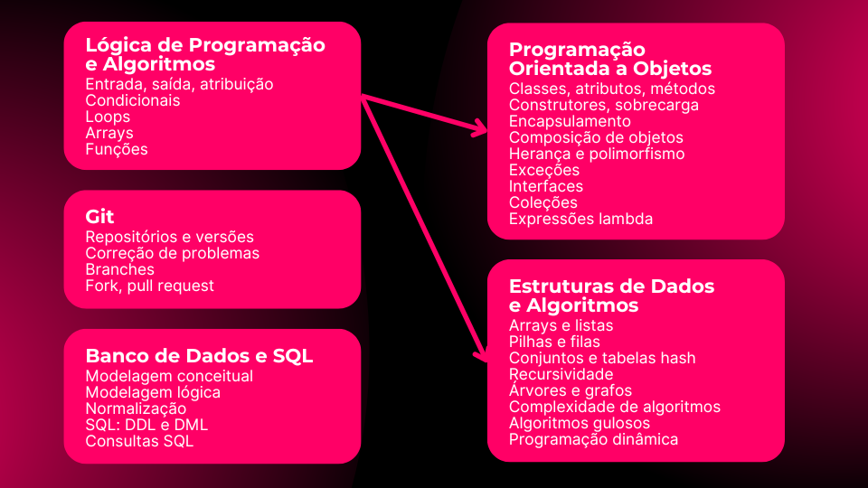

# Mapa de estudos da carreira Java

## Carreira desenvolvedor back end Java

O processo de formação para ingressar na carreira de programação pode ser dividido em duas grandes etapas: fundamentos e comercial.

Na etapa de fundamentos aprende-se as disciplinas que darão a base para atuar profissionalmente, saber analisar problemas e elaborar soluções.

Na etapa comercial, aprende-se a utilizar ferramentas de mercado para construção de sistemas do início ao fim.

## Fundamentos

### Iniciantes ou quem precisa repassar a base da faculdade

## Comercial

### Carreira desenvolvedor back end Java com Spring

